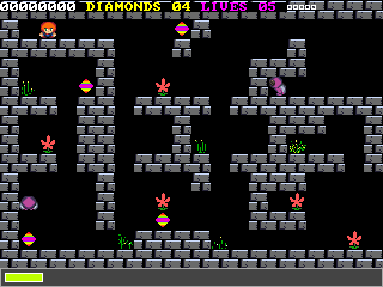
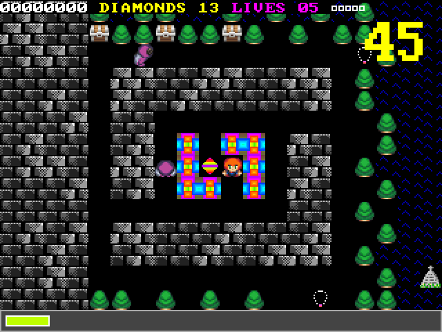
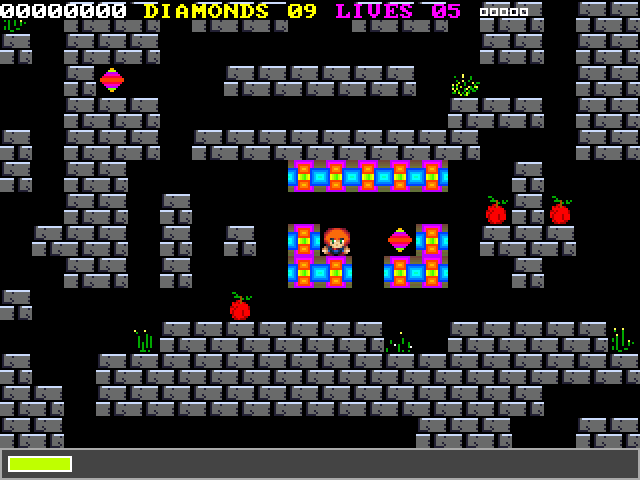
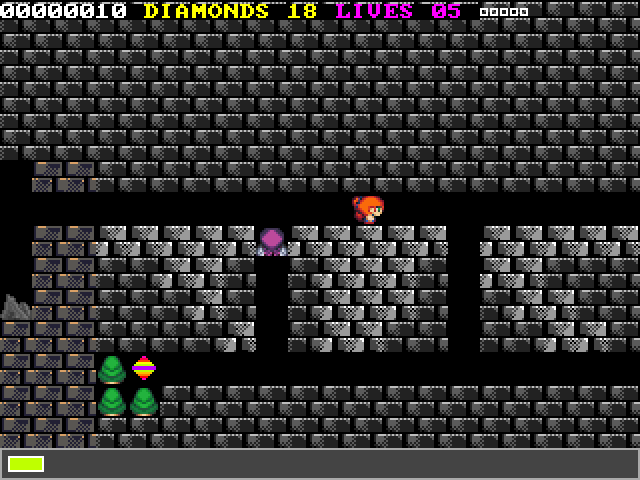

# CREEPSPREAD III (SDL2)

Diamond Hunter vs. Deadly Monsters! Brace yourself for high-speed, pixel-art arcade chaos powered by a dynamic tracker soundtrack.

CreepSpread III is a retro-inspired action game that blends fast-paced gameplay with fluid pixel graphics and a reactive audio system that evolves with the on-screen intensity. Master its challenging levels and uncover secrets as you battle through waves of monstrous foes.

Creepspread III is powered by SDL2, this project brings CreepSpread III to a wide range of platforms—play it as a native desktop app or directly in your browser.










## First look at the game


Check out the gameplay demo on [YouTube](https://www.youtube.com/watch?v=K8tYE7sSkcQ).

## Building the runtime

### Online version

The online version requires SDL2, zlib and Emscripten.

<b> Build cs3 runtime</b>

First install emscripten : https://emscripten.org/index.html

Run these commands

```
$ python bin/gen.py emsdl2
$ make
```

<b>Launch the application</b>

```
$ emrun build/cs3v2.html
```

### Mingw32 on Linux (manual)

<b>Building the docker image</b>

```
$ sudo docker build -t sdl2-mingw32-static . -f packages/docker/dockerfile-mingw32-static
```

<b>Deleting an existing image</b>

```
$ sudo docker rmi sdl2-mingw32-static

# also delete all caches
$ docker system prune -a
```

<b>Building cs3 runtime</b>

```
$ sudo docker run -it --rm -v "$(pwd)":/workspace sdl2-mingw32-static
$ python3 bin/gen.py mingw32-sdl2
$ make
```

## Join the chaos

Stay updated on the latest updates.

https://discord.gg/c7AmpFu4

## Other resources

### Map Editor

https://github.com/cfrankb/cs3-map-edit

### Play Online

https://cfrankb.itch.io/creepspread-iii

## License

This project is licensed under the GPL3 License. See [LICENSE](./LICENSE).

## Compliance

For third-party components and attribution, see [OPEN_SOURCE_COMPLIANCE.md](./OPEN_SOURCE_COMPLIANCE.md).
