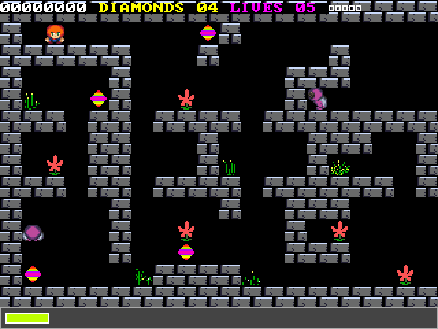
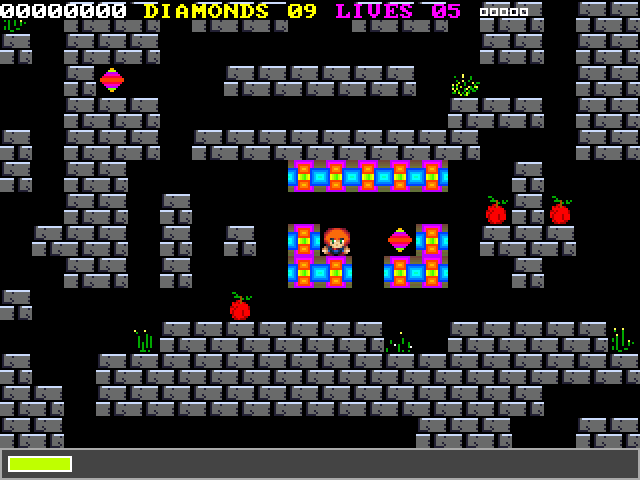
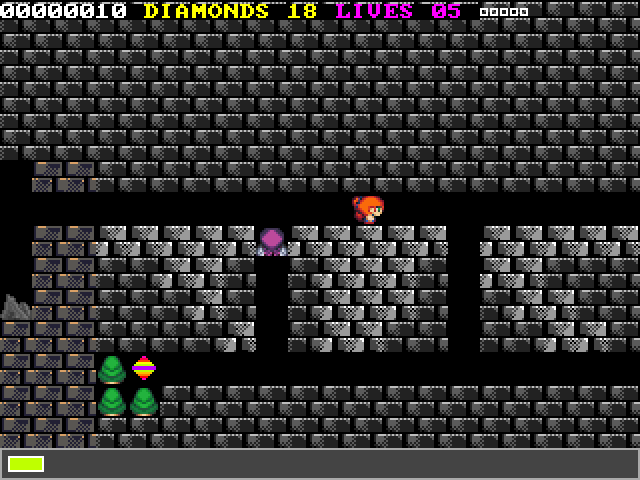

# CREEPSPREAD III (SDL3)

Diamond Hunter vs. Deadly Monsters! Brace yourself for high-speed, pixel-art arcade chaos powered by a dynamic tracker soundtrack.

CreepSpread III is a retro-inspired action game that blends fast-paced gameplay with fluid pixel graphics and a reactive audio system that evolves with the on-screen intensity. Master its challenging levels and uncover secrets as you battle through waves of monstrous foes.

Creepspread III is powered by SDL3, this project brings CreepSpread III to a wide range of platforms—play it as a native desktop app or directly in your browser.

## First look at the game

Check out the gameplay demo on [YouTube](https://www.youtube.com/watch?v=K8tYE7sSkcQ).

## Building the runtime

You build the game from the source code using the step provided.

See all the build options [here](techdocs/BUILD.md).

## Join the chaos

Stay updated on the [latest updates](https://disboard.org/server/1409084038689456182).

## Other resources

#### Map Editor

https://github.com/cfrankb/cs3-map-edit

#### Play Online

https://cfrankb.itch.io/creepspread-iii

## License

This project is licensed under the GPL3 License. See [LICENSE](./LICENSE).

## Compliance

For third-party components and attribution, see [OPEN_SOURCE_COMPLIANCE.md](techdocs/OPEN_SOURCE_COMPLIANCE.md).
