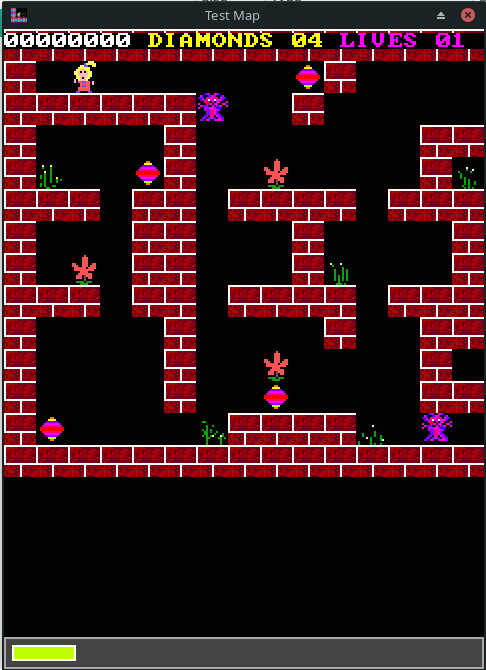

# CS3 Runtime SDL

This project aims to port to the CS3 Runtime to a wide variety of platforms. 

Using the SDL libraries as base, the game can now run as a desktop app or in the browser.

## Online version

### Building the runtime

The online version requires SDL, Zlib and Emscripten. 

https://emscripten.org/index.html

### Map Editor

https://github.com/cfrankb/cs3-map-edit

### Play online

https://cfrankb.com/games/ems/cs3v2.html

