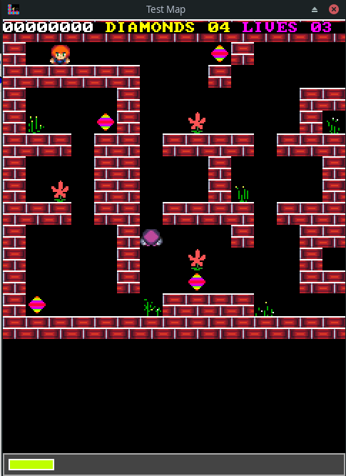

# CS3 Runtime SDL2

This project aims to port to the CS3 Runtime to a wide variety of platforms. 

Using the SDL2 libraries as a base, the game can now run as a desktop app or in the browser.





## Building the runtime

### Online version


The online version requires SDL2, zlib and Emscripten.


<b> Build cs3 runtime</b>

First install emscripten : https://emscripten.org/index.html

Run these commands
```
$ python bin/gen.py emsdl2
$ emmake make
```

<b>Launch the application</b>


```
$ emrun build/cs3v2.html
```


## Mingw32 on Linux

<b>Building the docker image</b>

```
$ sudo docker build -t sdl2-mingw32-static . -f docker/dockerfile-mingw32-static
```

<b>Deleting an existing image</b>

```
$ sudo docker rmi sdl2-mingw32-static

# also delete all caches
$ docker system prune -a
```

<b>Building cs3 runtime</b>

```
$ sudo docker run -it --rm -v "$(pwd)":/workspace sdl2-mingw32-static
$ python3 bin/gen.py mingw32-sdl2
$ make
```


## Other resources

### Map Editor

https://github.com/cfrankb/cs3-map-edit

### Play online

https://cfrankb.itch.io/creepspread-iii

